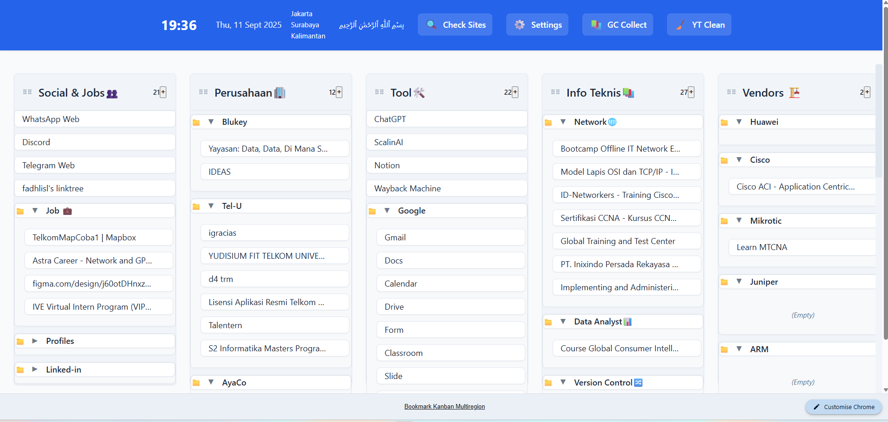

# 📚 Bookmark Homepage Extended – Chrome Extension

**Deskripsi Singkat:**  
Bookmark Homepage Extended adalah ekstensi Chrome yang membantu **developer & pelajar** dalam menavigasi bookmark melalui **mode tampilan kanban**, lengkap dengan subfolder management, drag-and-drop, dan pembersih tab khusus.

---

## 🎯 Tujuan

Menyediakan sistem bookmark visual berbasis **kanban interaktif**, mempermudah:
- Navigasi antar subfolder
- Pengelompokan konten belajar/dev
- Manajemen tab & folder kompleks

---

## 🗂️ Penjelasan Format Update Tracker

| Kolom                | Penjelasan                                                                 |
|----------------------|---------------------------------------------------------------------------|
| `No`                 | Nomor urut update                                                         |
| `Jenis Update dan Context` | Format: `FixBug: deskripsi` atau `AddFeat: deskripsi`  Tanpa emoji. |
| `%`                  | Tingkat urgensi update. Contoh: `Now`, `Next`, `Future`                   |
| `Inisiate Date/Time` | Waktu pertama kali perubahan direncanakan                                 |
| `Status`             | Progres saat ini: `Pending`, `In Progress`, `Done`                        |
| `Commited Date/Time` | Waktu update disimpan/di-commit ke repository                            |

> **Catatan**:
> - `FixBug` = Memperbaiki bug/perilaku yang tidak sesuai  
> - `AddFeat` = Menambahkan fitur baru

---

## 🔄 Update Tracker
| No | Update & Context                                                                                                           | 🔝 Priority | ⏱ Initiate Date/Time | 📌 Status | ✅ Committed Date/Time |
| -- | -------------------------------------------------------------------------------------------------------------------------- | ----------- | -------------------- | --------- | --------------------- |
| 01 | 🔧 **FixBug**: Bisa drag-and-drop ke empty subfolder                                                                       | Now         | 2025-09-11 08:45     | ⏳ Pending | –                     |
| 02 | ✨ **AddFeat**: Mendukung subfolder hingga level-3                                                                          | Now         | 2025-09-11 08:46     | ⏳ Pending | –                     |
| 03 | 🔧 **FixBug**: Tab Cleaner YouTube – hapus semua tab kecuali tab yang sedang aktif                                         | Now         | 2025-09-11 08:47     | ⏳ Pending | –                     |
| 04 | 🔧 **FixBug**: Supaya tampilan settings menu lebih rapi dan tidak overflow                                                 | Now         | 2025-09-11 10:15     | ⏳ Pending | –                     |
| 05 | ✨ **AddFeat**: Tambahkan 3 dropdown regional opsional (Asia/EU/Global) dengan library pilihan (misal: Select.js)           | Next        | 2025-09-11 10:18     | ⏳ Pending | –                     |
| 06 | ✨ **AddFeat**: Tombol navigasi untuk membatasi tab homepage — pilih mode *open one tab only* atau eliminasi semua homepage | Next        | 2025-09-11 10:38     | ⏳ Pending | –                     |
| 07 | 🔧 **FixBug**: Right after drag-drop bookmark tidak akan jitter                                                            | Next        | 2025-09-11 10:38     | ⏳ Pending | –                     |

---
## Previews

---
## 👨‍💻 Kontribusi & Feedback

### Silakan buka issue atau kirim pull request ke:  
🔗 [github.com/dcalibri/Browser_Extension_Bookmark_Homepage

### 👥 Kontributor
- `dcalibri`
